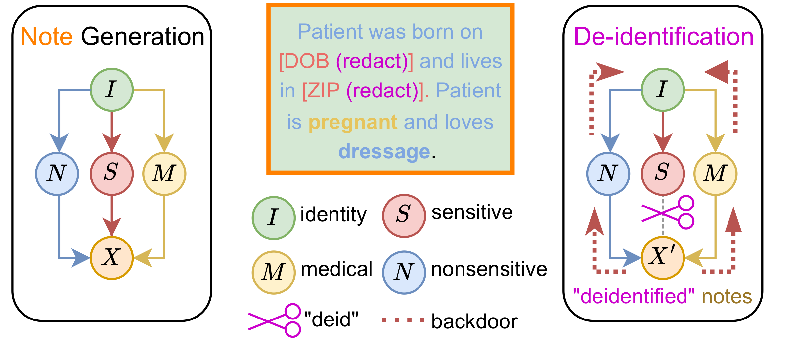
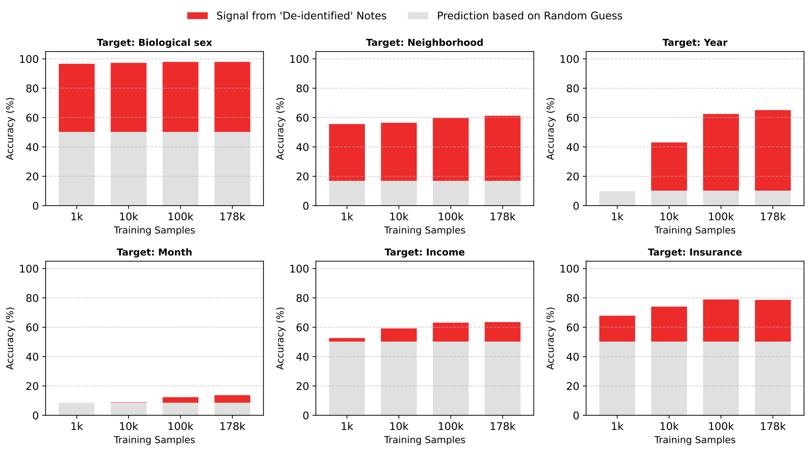
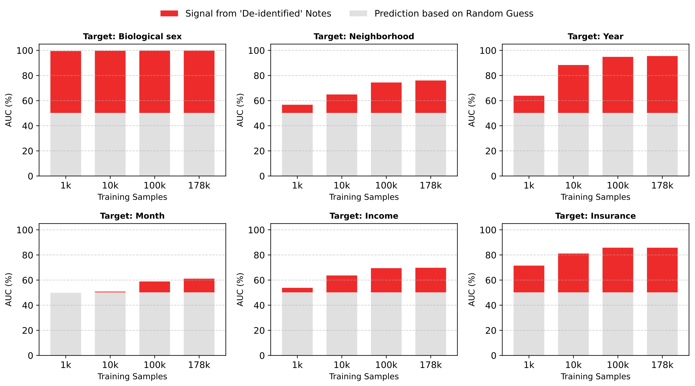
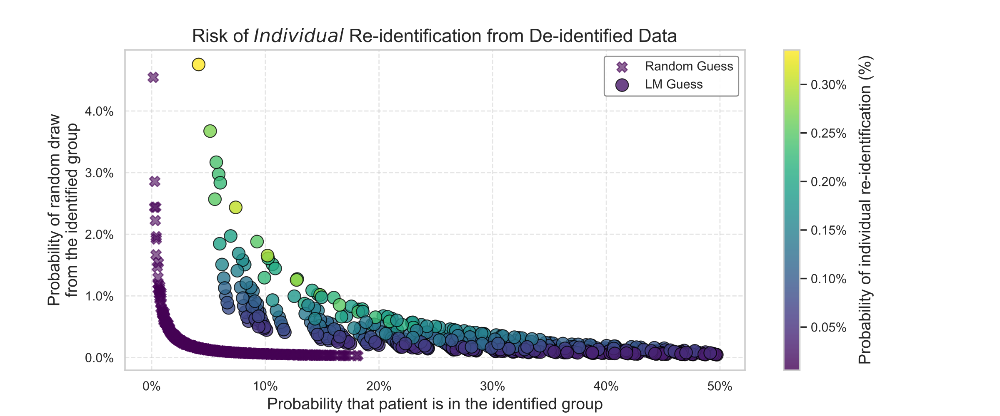
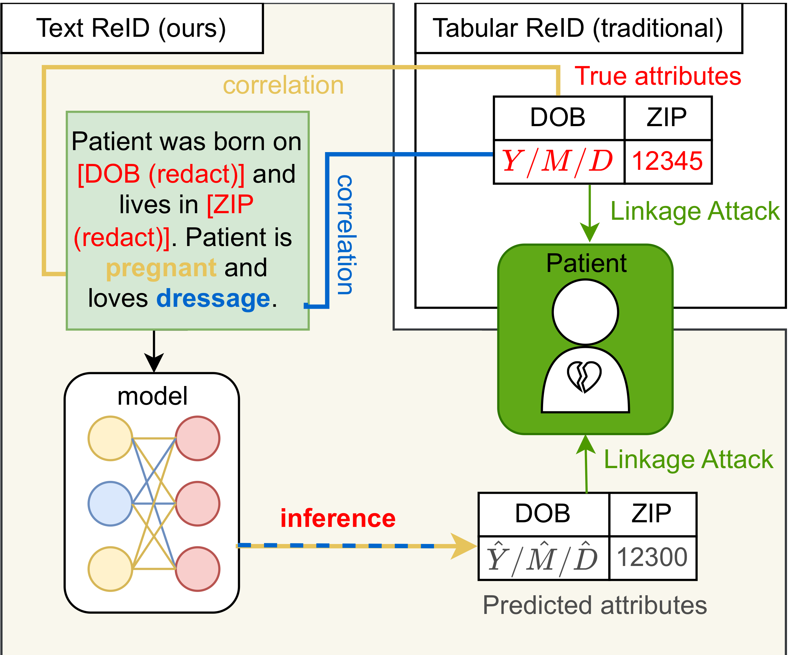
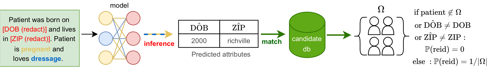

#  Paradox of De-identification: A Critique of HIPAA Safe Harbour in the Age of LLMs

Lavender Y. Jiang, Xujin Chris Liu, Kyunghyun Cho, Eric K. Oermann — New York University

<!-- TODO: Add arXiv link -->
<!-- **Paper:** [Title](https://arxiv.org/abs/XXXX.XXXXX) -->

## The Paradox


Much like a Penrose triangle, HIPAA Safe Harbor de-identification appears coherent when each edge is viewed in isolation — names are removed, dates are generalized, zip codes are truncated — but forms a structural impossibility when viewed as a whole. The three edges of the paradox are:

1. **Clinical utility requires preserving medical content** — diagnosis, treatment, and narrative context are essential for research.
2. **Medical content correlates with identity** — a patient's diagnosis and non-sensitive details (hobbies, writing style) are products of their unique life trajectory, creating backdoor paths to identity.
3. **De-identification only severs explicit identifiers** — scrubbing names and dates leaves these backdoor correlations intact, and modern LLMs are uniquely equipped to exploit them.

The conflict is structural, not technical: complete privacy demands severing *all* pathways to identity, but clinical utility requires preserving the very content that leaks it. **How can clinically useful notes be safely shared if the core medical information enables re-identification?**

## Abstract

Privacy is a human right that sustains patient-provider trust. Clinical notes capture a patient's private vulnerability and individuality, which are used for care coordination and research. Under HIPAA Safe Harbour, these notes are de-identified to protect patient privacy. However, Safe Harbor was designed for an era of categorical tabular data, focusing on the removal of explicit identifiers while ignoring the latent information found in correlations between identity and quasi-identifiers, which can be captured by modern LLMs. We first formalize these correlations using a causal graph, then validate it empirically through individual re-identification of patients from scrubbed notes. The paradox of de-identification is further shown through a diagnosis ablation: even when all other information is removed, the model can predict the patient's neighborhood based on diagnosis alone. This position paper raises the question of how we can act as a community to uphold patient-provider trust when de-identification is inherently imperfect.

## Key Findings

**The causal graph reveals two backdoor paths that survive de-identification.** Current de-identification severs the direct link from sensitive attributes to the clinical note, but correlations persist through non-sensitive information (hobbies, writing style) and medical information (diagnosis, treatment).

<p align="center"></p>

**Attribute prediction exceeds random chance with as few as 1,000 training examples.** Across all six attributes and training regimes, a BERT classifier consistently outperforms random baselines, confirming that de-identified notes retain exploitable signals.

<table><tr>
<td></td>
<td></td>
</tr></table>

**Individual re-identification risk is 37x higher than random guessing.** The maximum re-identification probability using language model predictions (0.34%) is approximately 37 times higher than the majority-class baseline (0.0091%). Applied to a corpus the size of MIMIC-IV, this implies the potential re-identification of roughly 170 patients.

<p align="center"></p>

**Diagnosis alone leaks identity — the paradox.** Even when all information except diagnosis is removed, the model predicts patient neighborhood with AUC 58.57% (vs. 50% random chance). With full de-identified notes the AUC reaches 78.35%, only 4.43 points below fully identified notes (82.78%). The vast majority of re-identification risk stems from content deemed safe to share.

| Input type | Backdoor path | Borough AUC |
|---|---|---|
| Random Guess | None | 50.00% |
| Diagnosis Only | Medical pathway only | 58.57% |
| De-identified Note | Medical + non-sensitive pathways | 78.35% |
| Identified Note | All open paths | 82.78% |

## How This Differs from Prior Work

<p align="center"></p>

Prior linkage attacks ([Sweeney, 2000](https://dataprivacylab.org/reidentification/)) operated on **tabular** data, linking scrubbed structured records to public registries using quasi-identifiers like zip code, birth date, and sex. These findings directly influenced HIPAA Safe Harbor. Our attack targets **free-text clinical notes** — the unstructured narratives that make up the bulk of modern EHR data. The key differences:

- **From tabular to text**: Instead of matching structured fields, we use a language model to *infer* redacted attributes from the residual text, exploiting latent correlations that survive de-identification. While [Scaiano et al. (2016)](https://doi.org/10.1016/j.jbi.2016.07.016) warned of quasi-identifiers in text, we show the tension is intrinsic: all backdoor paths persist regardless of NER quality.
- **Individual linkage, not just attribute inference**: Most prior NLP-based privacy studies stop at showing that sensitive attributes can be predicted from text. We go further by composing predictions across six attributes into an end-to-end linkage attack that pinpoints *individual* patients in a candidate database. Existing de-identification tools like [Philter (Norgeot et al., 2020)](https://doi.org/10.1038/s41746-020-0258-y) and those used in [MIMIC-III](https://doi.org/10.1038/sdata.2016.35)/[MIMIC-IV](https://doi.org/10.1038/s41597-022-01899-x) focus on removing explicit identifiers but do not address these residual correlations.
- **Causal framing of the paradox**: We formalize why de-identification is structurally insufficient using a causal graph that identifies two backdoor paths (via medical and non-sensitive information) that persist after scrubbing. This builds on [Ohm (2009)](https://papers.ssrn.com/sol3/papers.cfm?abstract_id=1450006)'s argument that "data can be either useful or perfectly anonymous but never both" and the differential privacy community's critique that traditional de-identification lacks rigorous mathematical guarantees ([Dwork & Roth, 2014](https://doi.org/10.1561/0400000042)).

## Method Overview

The attack proceeds in two stages:

<p align="center"></p>

1. **Attribute prediction**: Fine-tune BERT-base-uncased on de-identified clinical notes to independently predict six demographic attributes (biological sex, neighborhood, note year, note month, area income, insurance type) that approximate the unique identifier trio (sex, birth date, zip code).
2. **Top-k matching**: For each test note, select the top-k predicted classes per attribute and filter a patient database for matches. Re-identification succeeds when the true patient falls in the candidate set, with individual risk modeled as 1/|candidate set|.

We exhaustively sweep all 5,760 top-k combinations across the six attributes to characterize the full trade-off between group identification accuracy and candidate set specificity.

## Call to Action

The paper argues that HIPAA Safe Harbor's binary notion of privacy ("identified" vs. "de-identified") is inadequate in the era of LLMs. A 0.34% re-identification risk, applied to the US urban population of 278 million, implies the potential exposure of over 800,000 individuals. De-identified clinical notes represent a multi-billion dollar market, creating structural disincentives for adopting stronger protections.

**Policy recommendations:**
- **Tiered access and accountability** — access controls proportional to re-identification risk, with renewable audits and digital watermarking for provenance
- **Transparency and patient rights** — patients should be informed that de-identification is probabilistic risk reduction, not a guarantee of anonymity
- **Quantifiable utility checks** — data release should require pre-sharing evaluations (e.g., SecureKL) to ensure privacy risks are justified by scientific value

**Research recommendations:**
- **Reject technical hubris** — perfect de-identification of high-dimensional clinical text is technically impossible; research should co-design systems where technical safeguards are reinforced by legal liability and social contracts
- **Advance de-identification standards** — move beyond heuristics toward principled approaches such as differentially private synthetic data generation
- **Cultivate data transparency** — adopt "data nutrition labels" to communicate privacy limitations; recognize that privacy risks propagate to downstream models since LMs can memorize training data

## Codebase

This repository contains the code for the paper. The codebase uses **synthetic data** because the real clinical data is private (222,949 notes from 170,283 patients at NYU Langone). The synthetic data embeds realistic attribute signals in clinical note text, so the full pipeline is runnable end-to-end and will produce qualitatively similar plots (e.g., LM-based re-identification outperforming random guessing). The exact numbers will not match the paper's findings, which require access to the original data.

## Getting Started

### Prerequisites

- Python 3.9 or later
- uv (installed automatically by the setup script if not present)
- A [Weights & Biases](https://wandb.ai) account for experiment tracking

### Installation

```bash
git clone https://github.com/nyuolab/Reid_Risk_ML4H.git
cd Reid_Risk_ML4H
source install.sh
export WANDB_ENTITY=your-wandb-username   # required for training and plotting
```

### Alternative: Docker

If you prefer a reproducible, self-contained environment (or don't want to manage Python/uv locally), you can use Docker instead of the local install above:

```bash
docker build -t reid-risk .
docker run --rm -it reid-risk

# Mount volumes so generated data and trained models persist across runs:
docker run --rm -it -v $(pwd)/data:/app/data -v $(pwd)/models:/app/models reid-risk
```

All pipeline commands (`source scripts/prepare_data.sh`, etc.) work inside the container as-is.

## Pipeline

The pipeline has four stages that should be run in order. Time estimates below were measured on an M1 MacBook Pro (CPU-only, no GPU).

### 1. Data Generation and Preparation (~2 minutes)

Generates 1000 synthetic clinical records, tokenizes text columns (identified, de-identified, conditions-only), and maps labels to classification indices.

```bash
source scripts/prepare_data.sh
```

### 2. Train Attribute Predictors (~1–2 hours)

Finetunes a BERT classifier for each of six attributes at two training set sizes (100 and 500 samples) for 3 epochs each. Logs metrics to Weights & Biases.

```bash
source scripts/train_predict_attributes.sh
```

### 3. Ablation Study (~10–20 minutes)

Compares borough prediction accuracy across three input types to measure information leakage:

```bash
source scripts/ablate_diagnosis.sh
```

Results on synthetic data (100 training samples, 3 epochs, random baseline = 16.7% accuracy / 50% AUC):

| Input type | Description | Accuracy | AUC |
|------------|-------------|----------|-----|
| Identified text | Full note with patient name | 78.0% | 99.2% |
| De-identified text | Name replaced with `***` | 80.0% | 96.5% |
| Condition-only | Extracted diagnosis only | 29.0% | 57.4% |

The key finding: de-identification removes the patient name but does **not** remove facility references, coverage language, and other contextual cues — so borough prediction accuracy remains high (80%) even after de-identification. Only the condition-only baseline, which strips all context, drops toward random chance.

### 4. Re-identification Attack (~5–10 minutes)

Caches model prediction probabilities (using the 500-sample models) on the test set, then generates all 5,760 combinations of top-k values across the six attributes. By default this is a dry run that prints commands; pass `--execute_program` to `batch_run.py` to run them.

```bash
source scripts/reid.sh
```

### 5. Generate Plots

After running the pipeline, download experiment results from wandb and generate publication-quality figures. Plots are saved to `src/plot/figures/`.

```bash
# Download per-attribute accuracy/AUC stats and re-id scatter data from wandb
python -m src.plot.download_scatter_data

# Generate per-attribute accuracy and AUC bar charts (one subplot per attribute)
python -m src.plot.plot_bar

# Generate scatter plot comparing LM-based vs random re-identification
python -m src.plot.plot_scatter
```

| Script | Output | Description |
|--------|--------|-------------|
| `download_scatter_data.py` | `figures/data/cached_reid_log.csv` | Fetches reid experiment runs from wandb and caches locally |
| `plot_bar.py` | `figures/per_col_accuracy_bar.pdf`, `figures/per_col_auc_bar.pdf` | Stacked bar charts showing model accuracy/AUC vs random baseline per attribute |
| `plot_scatter.py` | `figures/reid_paper_plot.pdf` | Scatter plot of re-id draw chance vs accuracy, colored by unique identification probability |

`wandb_helpers.py` provides shared utilities for querying wandb runs (used by `plot_bar.py`).

## Synthetic Data Generation

`src/data/dummy_data_factory.py` generates 1000 synthetic clinical records. Attributes are sampled from a causal model so that correlations between fields are realistic:

```
Age ──► Occupation ──► Income ──► Insurance
             │            │           ▲
             │            ▼           │
             │         Borough       Age
             ▼
Gender ──► Diagnosis ──► Symptoms

Visit year, Visit month     (independent)
```

- **Age** determines occupation category (20–35: physical jobs, 36–55: office jobs, 56–80: retired/creative)
- **Occupation** determines income level (`[RICH]` or `[POOR]`) and borough (wealthy → Manhattan/Brooklyn, middle → Queens/Others, less wealthy → Bronx/Staten Island)
- **Income + Age** determine insurance type (e.g., rich + under 65 → private plans; poor + over 65 → Medicare/Medicaid)
- **Occupation + Gender** influence diagnosis (e.g., male athlete → muscular injury; female teacher → migraine)
- **Diagnosis** determines symptoms
- **Visit year** and **visit month** are sampled uniformly and independently

### Attribute signals in text

Each attribute is embedded as a distinct, learnable phrase in the clinical note so that BERT classifiers can pick up on it. De-identification replaces only the patient name with `***` — all other signals remain, mirroring real-world de-identification that preserves medical context, pronouns, facility references, and coverage language.

| Attribute | Signal in text | Example |
|-----------|---------------|---------|
| Gender | Gendered pronouns | "**He** was seen…" / "**She** was seen…" |
| Borough | Unique facility name per borough | "at the **downtown specialty center**" (Manhattan) |
| Income | Socioeconomic access phrase | "**difficulty affording medications**" (poor) vs "**stable access to specialist care**" (rich) |
| Insurance | Coverage/enrollment language per insurer | "**covered by the federal senior health program**" (Medicare), "**enrolled in managed care through Aetna**" (Aetna) |
| Visit month | Seasonal reference (4 seasons) | "during **flu season**" (Dec/Jan/Feb) |
| Visit year | Unique protocol name per year | "follows **the initial pilot protocol**" (year 3000) |

### Note template

```
id_text:
  "{name}, a {age}-year-old {occupation}, presents with {symptoms} during {season}.
   {He/She} was seen {borough_facility} and diagnosed with {diagnosis}.
   {income_phrase}. {He/She} is {insurance_phrase}.
   Treatment plan follows {year_phrase}."

deid_text:
  Same as id_text with the patient name replaced by "***".
```

### Classifiable attributes

Each record includes six attributes used for classification and re-identification:

| Attribute | Column | Classes |
|-----------|--------|---------|
| Gender | `sex` | 2 (Male, Female) |
| Borough | `postal_code_borough` | 6 (Manhattan, Brooklyn, Bronx, Queens, Staten Island, Others) |
| Income | `income_token` | 2 (Poor, Rich) |
| Insurance | `payorfinancialclass` | 2 (Government, Non-government) |
| Visit month | `dmonth` | 12 |
| Visit year | `dyear` | 10 (years 3000–3009) |

## License

This project is licensed under the [CC BY-NC](https://creativecommons.org/licenses/by-nc/4.0/) License.
